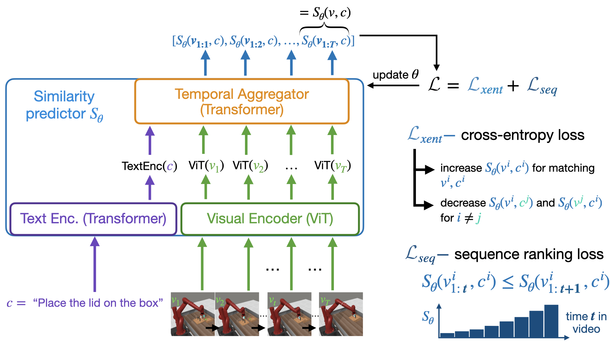

# Video-Language Critic: Transferable Reward Functions for Language-Conditioned Robotics 

[Minttu Alakuijala](https://minttualakuijala.com/)<sup>1</sup>, [Reginald McLean](https://www.reggiemclean.ca)<sup>2</sup>, [Isaac Woungang](http://cs.torontomu.ca/~iwoungan)<sup>2</sup>, [Nariman Farsad](http://narimanfarsad.com/)<sup>2</sup>, [Samuel Kaski](https://people.aalto.fi/samuel.kaski)<sup>1,3</sup>, [Pekka Marttinen](https://users.ics.aalto.fi/pemartti/)<sup>1</sup>, [Kai Yuan](https://scholar.google.com/citations?user=8eLlbhMAAAAJ&hl=en) <sup>4</sup>

<sup>1</sup>Department of Computer Science, Aalto University, <sup>2</sup>Department of Computer Science, Toronto Metropolitan University, <sup>3</sup>Department of Computer Science, University of Manchester, <sup>4</sup>Intel Corporation

## This is the official training reinforcement learning training code for VLC, a reward model trained using contrastive learning and a temporal ranking objective for downstream robotics tasks.



## Table of Contents  
[Installation](#installation)  

[VLC Experiments](#vlc-experiments)

[License](#license)

[Citation](#citation)

[Acknowledgement](#acknowledgement)

## Installation
If you do not have Video Language Critic (VLC) installed, please install this [repo](https://github.com/minttusofia/video_language_critic) first.

We do recommend creating an environment via [miniconda](https://docs.anaconda.com/free/miniconda/) as it can handle the requirements for headless rendering.

```
conda create -n vlc_rl python=3.10 pip
```

After cloning this repo, in the same environment that VLC is installed in:

```
cd vlc_rl
git submodule update --init --recursive
cd Metaworld
pip install -e .
cd ../Gymnasium
pip install -e .
cd ../
pip install -r requirements.txt
pip install 'jax[cuda12]==0.4.23'
```
Next we will need to setup the paths.py file
```
cp paths_template.py paths.py
```
then edit paths.py with your favourite text editor, replacing the paths with your local paths.
```MW_DATA_DIR``` should point to the data from VLC. This can be downloaded from this [Google Drive](https://drive.google.com/drive/folders/1DBgMbMyDjTmFR8dOuzllDeRUqJZW9Sex?usp=sharing).
The ```REWARD_CKPT_DIR``` should point to a folder that contains the VLC checkpoint files, also from this [Google Drive](https://drive.google.com/drive/folders/1DBgMbMyDjTmFR8dOuzllDeRUqJZW9Sex?usp=sharing).
```EXP_DIR``` will be the output of the experiment. 

All needed data can be downloaded with the following commands:
MW_DATA: ```gdown 1u0aNE2pnsWTC669tVwZ0zv-5Zk42-S-R```
REWARD_CKPT: ```gdown 1hWpQO7nWIM5IhY4fRI0LxxABTmQ7LIvo```

## VLC Experiments

### Replication
```
python sac_jax.py --env-id door-unlock-v2 --exp-name mtmhsac_jax --track --save-model --seed 12345 --reward-normalization-gymnasium --reward-normalization-offset --predict-for-partial-videos --stretch-partial-videos --sparse-reward-weight=50 --vlm-reward-weight=1 --evaluation-frequency 20000 --vlc-ckpt ckpt_mw50_retrank33_tigt_negonly_a_rf_1__pytorch_model.bin.20
```

### Rendering
This repo currently uses [EGL](https://www.khronos.org/egl) which should be supported on current NVIDIA GPU's. Untested on AMD/Intel GPUs. 
By using EGL, there should be no extra changes that need to be made. Alternative rendering methods such as osmesa can also be used.

## License
The source code in this repository is licensed under the **X** License.

## Citation
If you find this repository or paper useful for your research, please cite

```
@article{alakuijala2024videolanguage,
      title={Video-Language Critic: Transferable Reward Functions for Language-Conditioned Robotics}, 
      author={Minttu Alakuijala and Reginald McLean and Isaac Woungang and Nariman Farsad and Samuel Kaski and Pekka Marttinen and Kai Yuan},
      year={2024},
      eprint={2405.19988},
      archivePrefix={arXiv},
      primaryClass={cs.RO}
}
```
## Acknowledgement
This implementation is based off [CleanRL](https://github.com/vwxyzjn/cleanrl). Thanks to [Evangelos](https://github.com/evangelos-ch) and [Frank](https://github.com/frankroeder) for the implementation! 
